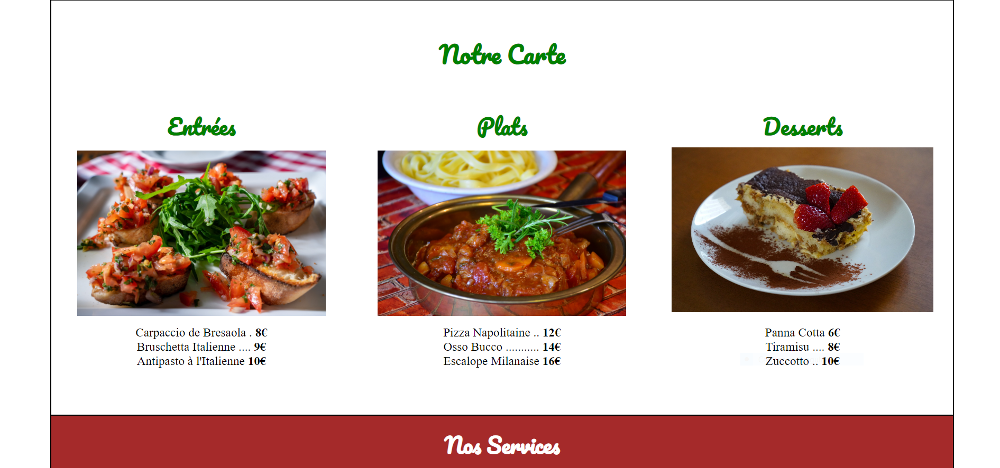

Projet d'Intégration HTML/CSS
=
Ce dépôt GitHub contient une intégration HTML/CSS d'une page web statique. Il s'agit d'un exemple simple de code HTML et CSS pour créer une page web responsive et attrayante.

Aperçu
=


Contenu
=
Ce projet comprend les éléments suivants :

- ***index.html***: Le fichier HTML principal de la page web.
- ***styles.css***: Le fichier CSS contenant les styles de la page.
- ***images/***: Un répertoire contenant les images utilisées sur la page.
  
Comment Utiliser
=
Pour utiliser ce projet, suivez ces étapes :

1. Clonez ce dépôt sur votre machine locale :
```
git clone https://github.com/votre-utilisateur/integration-html-css.git
```
2. Ouvrez le fichier ***index.html*** dans votre navigateur pour afficher la page web.

Personnalisation
=
Vous pouvez personnaliser cette intégration en modifiant le contenu HTML et les styles CSS selon vos besoins. Voici quelques points à considérer :

- Modifiez le contenu du fichier ***index.html*** pour y inclure votre propre texte, images, liens, etc.
- Personnalisez les styles dans le fichier ***styles.css*** pour adapter la mise en page et les couleurs selon votre propre design.
Licence
Ce projet est sous licence MIT, ce qui signifie que vous pouvez l'utiliser et le modifier librement, à condition de conserver l'avis de licence.

Auteur
=
Charly Damême
